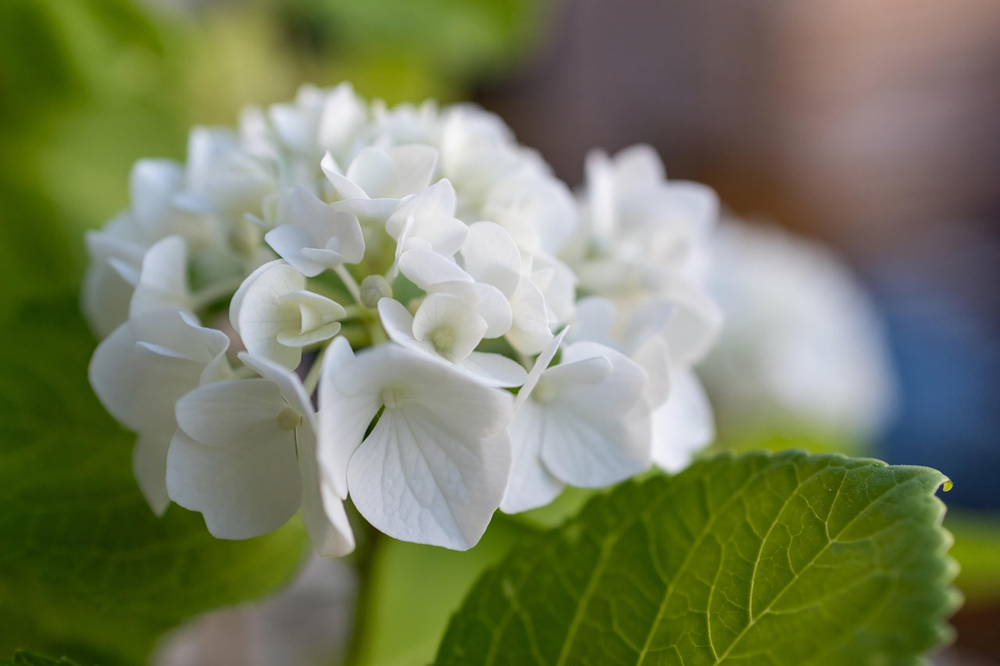

# Image classifier using Pytorch
\
 We will be using <a href="http://www.robots.ox.ac.uk/~vgg/data/flowers/102/index.html">this data</a> of 102 flower categories.
Here you'll use torchvision to load the data (documentation). The data should be included alongside this notebook, otherwise you can <a href="https://s3.amazonaws.com/content.udacity-data.com/nd089/flower_data.tar.gz">Download it here</a>.

<i><b>Data Description</i></b>

The dataset is split into three parts, training, validation, and testing. For the training, you'll want to apply transformations such as random scaling, cropping, and flipping. This will help the network generalize leading to better performance. You'll also need to make sure the input data is resized to 224x224 pixels as required by the pre-trained networks.

The validation and testing sets are used to measure the model's performance on data it hasn't seen yet. For this you don't want any scaling or rotation transformations, but you'll need to resize then crop the images to the appropriate size.

The pre-trained networks you'll use were trained on the ImageNet dataset where each color channel was normalized separately. For all three sets you'll need to normalize the means and standard deviations of the images to what the network expects. For the means, it's [0.485, 0.456, 0.406] and for the standard deviations [0.229, 0.224, 0.225], calculated from the ImageNet images. These values will shift each color channel to be centered at 0 and range from -1 to 1.

The project is broken down into multiple steps:

Load and preprocess the image dataset

Train the image classifier on your dataset

Use the trained classifier to predict image content

<b>Image Classifier for Detecting Varieties of Flowers</b>
